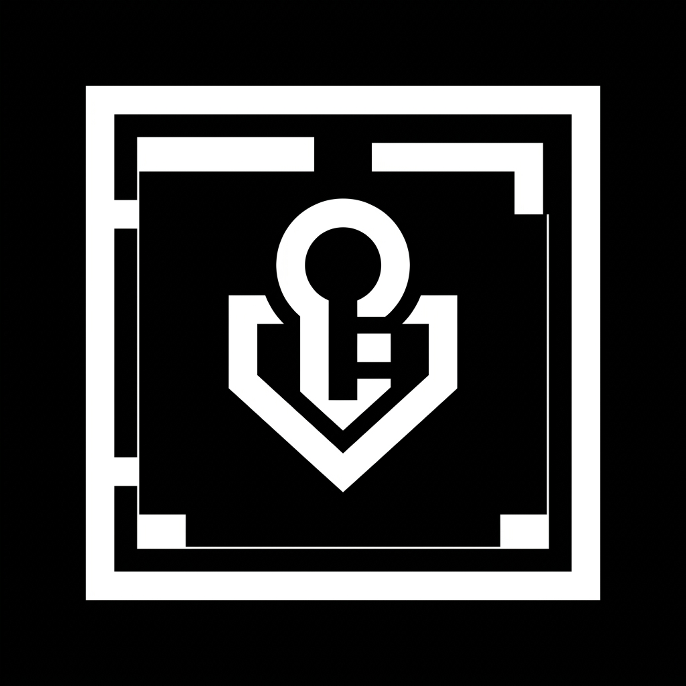

<div align="center">
  
  <h1>Prompt Vault</h1>
  <p>A high-performance, professional desktop application for managing, organizing, and utilizing AI prompts and code snippets.</p>
</div>

---

## Features
- **Ultra-Fast Performance**: Powered by a Rust & Tauri v2 backend, ensuring instant startup times and minimal memory usage.
- **Monochrome Dark Mode UI**: A highly polished, professional dark mode aesthetic built with modern grid systems and a cohesive typography layout.
- **Local-First Privacy**: All snippets and categories are stored directly on your machine in a local SQLite database. No cloud telemetry, no data collection.
- **Native OS Clipboard integration**: Seamless one-click clipboard functionality that utilizes native operating system APIs for maximum reliability.
- **Advanced Organization**: Categorize prompts with custom color-coded folders and a real-time tagging system.
- **Code Highlighting**: Professional syntax highlighting built-in for markdown and various programming languages within the application.
- **Global Search**: Instantly locate snippets using the global search bar, which actively filters across titles, content, and tags in real-time.

## Tech Stack
- **Frontend**: React 19, TypeScript, Vite
- **Styling**: Vanilla CSS, Monochrome Material Design 3 Guidelines
- **Backend**: Rust, Tauri v2
- **Database**: SQLite (`@tauri-apps/plugin-sql`)

## Installation
1. Navigate to the **[Releases](../../releases)** page.
2. Download the appropriate `.msi` or `.exe` installer for your system.
3. Run the installer to deploy Prompt Vault on your machine.

## Development
To run this project locally, you must have [Node.js](https://nodejs.org/) and [Rust](https://www.rust-lang.org/tools/install) installed.

```bash
# Install Node dependencies
npm install

# Run the application in development mode with hot-reloading
npm run tauri dev

# Build the final production executable
npm run tauri build
```

## License
This project is licensed under the MIT License - see the [LICENSE](LICENSE) file for details.
